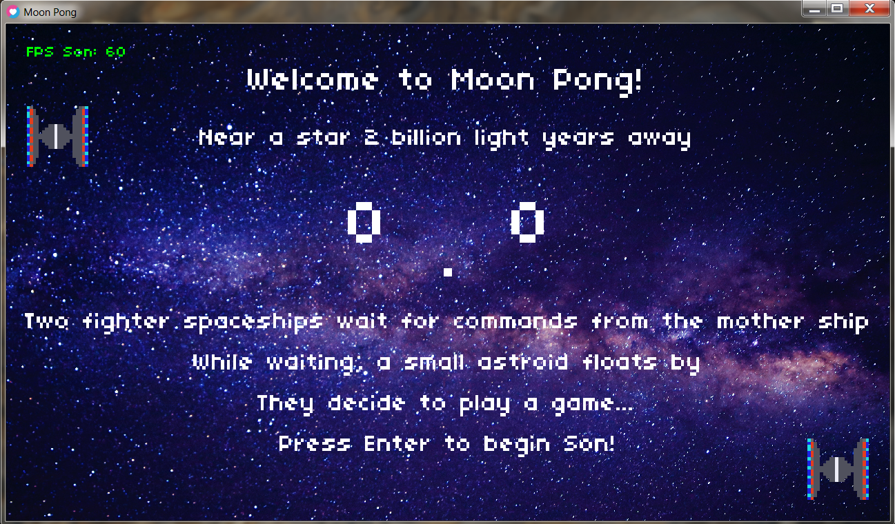
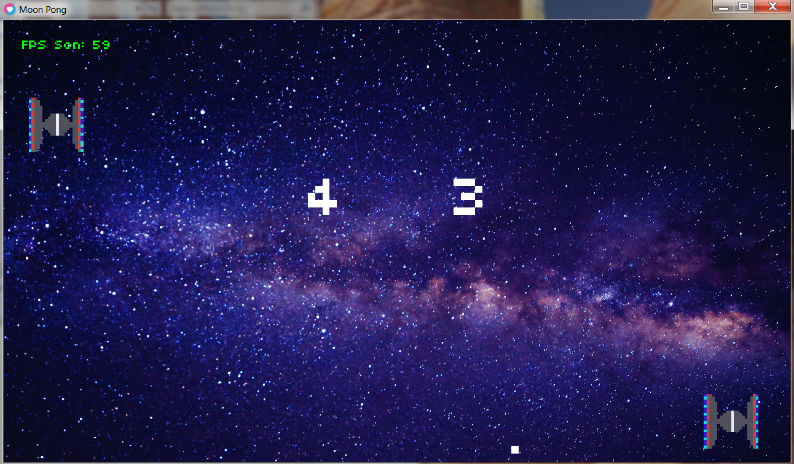
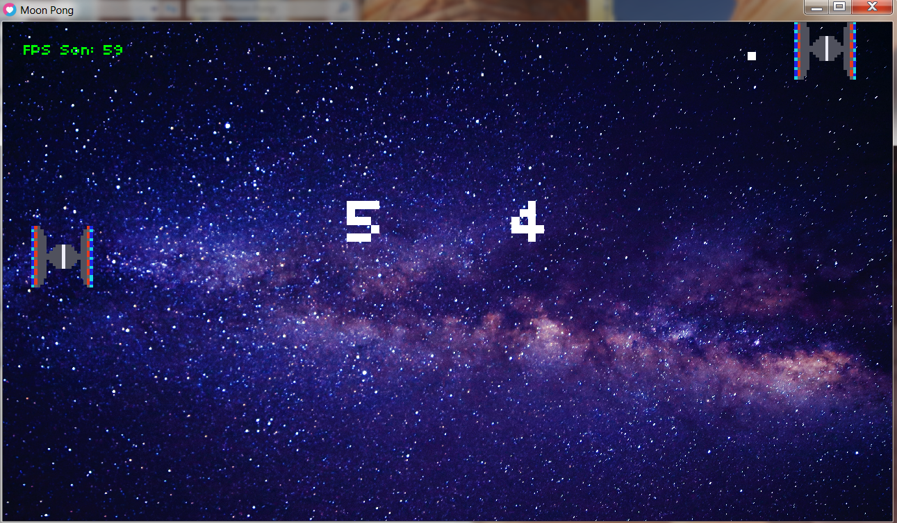
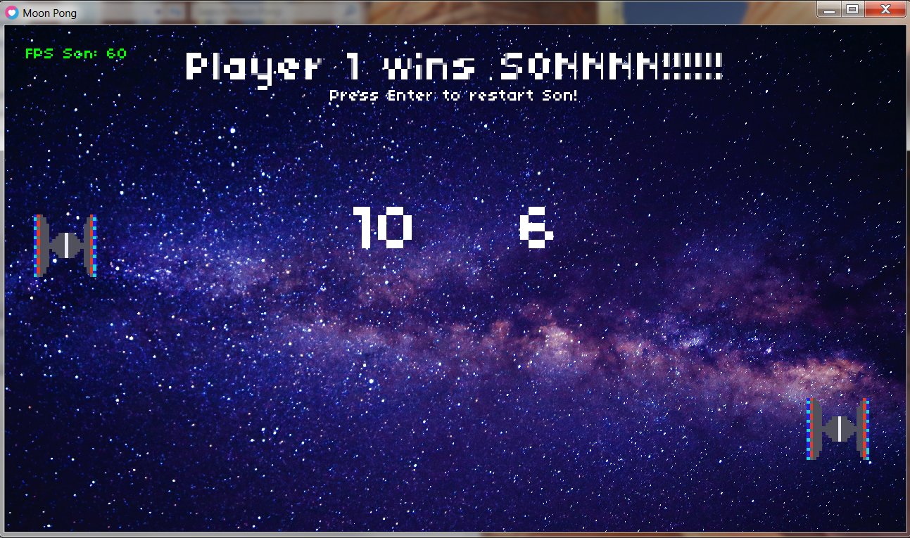

# Moon_Pong-AI-

Version 2 of Moon Pong video game coded in programming language 'Lua' and tested in LOVE2D. Pixel art done in GIMP. 

HOW TO DOWNLOAD: Download the file by clicking on the GREEN "Code" buttom above. It will download all files in a zip folder. Unzip the folder, and inside you will see seven (7) items. You can delete the four (4) PNG image files, they are just screenshots from the game. You can also delete the folder "Moon Pong - Code" unless you would like to format the code for the game. The folder "Moon Pong - Final Game" is the folder with the playable game! Leave this folder in tact, you can move it to your desktop or any other location, as long as all eight (8) items stay within that folder. There should be seven (7) .dll files along with an .exe file titled Moon_Pong. Double click and enjoy!

INSTRUCTIONS/ HOW TO PLAY: Player 1 uses the keyboard keys 'up' to move up and 'down' to move down. Press enter to move on from the Title Screen. Player 1 serves by pressing enter, and Player 2 which is an AI will move the spaceship up or down to block and send the ball back. If the ball crosses the screen Player 1 will get a point. First one to 10 points wins! 

This is what the Title Screen looks like, which the game story. 

The next two shots are gameplay

This is what it looks like if Player 1 wins

Version 2
Added an AI bot for a one player game

ENJOY!

Aman Hafeez
Mechanical Engineer 
amanhaf@gmail.com
amanhafeez.com
